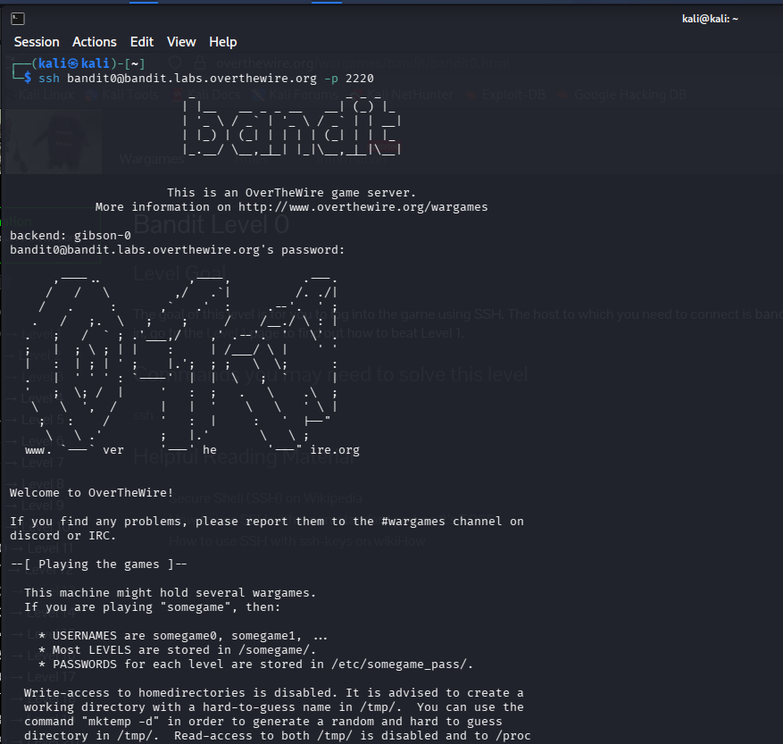
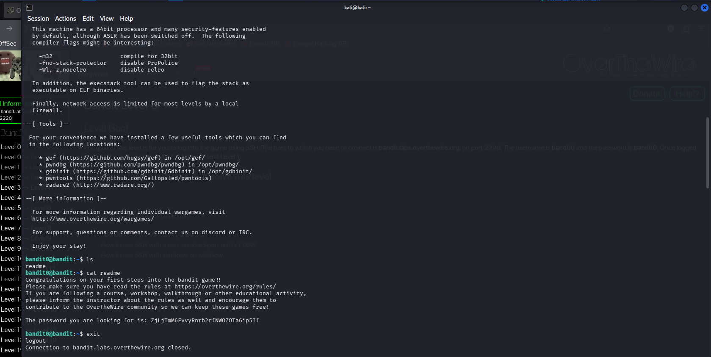

# OverTheWire Bandit — Level 0 & Level 0 → 1
 
## Level 0 — Logging In via SSH
 
### Objective
Connect to the Bandit game server using SSH for the first time.
 
### Connection Details
| Field    | Value                             |
|----------|-----------------------------------|
| Host     | `bandit.labs.overthewire.org`     |
| Port     | `2220`                            |
| Username | `bandit0`                         |
| Password | `bandit0`                         |
 
### Command Used
```bash
ssh bandit0@bandit.labs.overthewire.org -p 2220
```
 

 
### Explanation
- `ssh` — initiates a Secure Shell connection
- `bandit0@bandit.labs.overthewire.org` — username @ host
- `-p 2220` — specifies the non-default port (default SSH port is 22)
Once prompted, enter the password: `bandit0`
 
### What You See After Login
The server greets you with the OverTheWire banner and some useful info:
 
 
- Passwords for each level are stored in `/etc/bandit_pass/`
- A working directory tip: use `mktemp -d` to create a temp dir in `/tmp/`
- ASLR is disabled on this machine; useful flags for later pwn challenges:
  - `-m32` — compile for 32-bit
  - `-fno-stack-protector` — disable ProPolice
  - `-Wl,-z,norelro` — disable RELRO
- Tools available: `gef`, `pwndbg`, `gdbinit`, `pwntools`, `radare2`
### Key Takeaway
SSH is the primary way to interact with remote Linux systems. Always pay attention to non-standard ports (`-p` flag).
 
---
 
## Level 0 → Level 1 — Reading a File
 
### Objective
Find the password for Level 1, stored in a file called `readme` in the home directory.
 
### Commands Used
```bash
ls
cat readme
```
 
### Explanation
- `ls` — lists files in the current directory; reveals the file `readme`
- `cat readme` — prints the contents of the file to the terminal
### Output
 

 
```
Congratulations on your first steps into the bandit game!!
Please make sure you have read the rules at https://overthewire.org/rules/
...
The password you are looking for is: ZjLjTmM6FvvyRnrb2rfNWOZOTa6ip5If
```
 
### Password Found
```
ZjLjTmM6FvvyRnrb2rfNWOZOTa6ip5If
```
