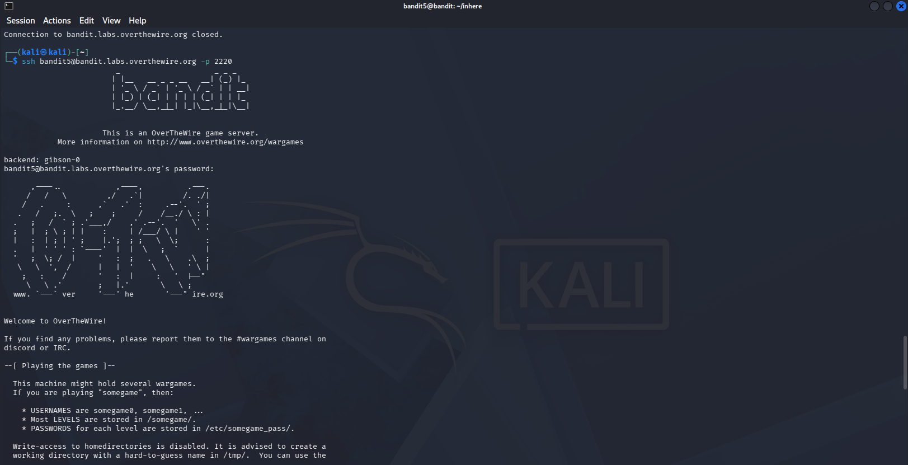
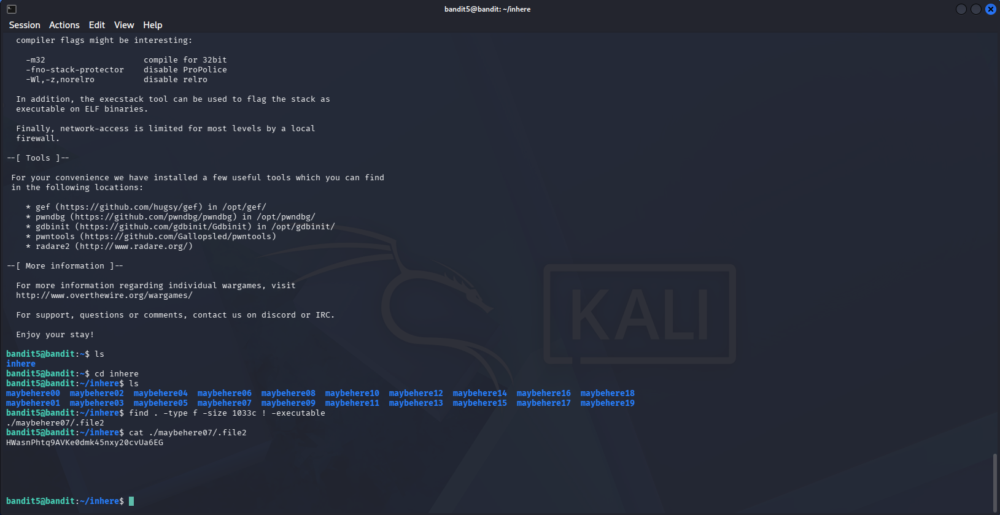

# OverTheWire Bandit — Level 5 → Level 6
 
## Objective
The password is stored somewhere inside the `inhere` directory in a file that is:
- Human-readable
- 1033 bytes in size
- Not executable
## Connection Details
| Field    | Value                             |
|----------|-----------------------------------|
| Host     | `bandit.labs.overthewire.org`     |
| Port     | `2220`                            |
| Username | `bandit5`                         |
| Password | `4oQYVPkxZOOEO05pTW81FB8j8lxXGUQw` |
 
## Command Used to Login
```bash
ssh bandit5@bandit.labs.overthewire.org -p 2220
```
 

 
---
 
## The Challenge
The `inhere` directory contains 20 subdirectories (`maybehere00` to `maybehere19`), each with multiple files. Searching manually would take forever.
 
```bash
ls
cd inhere
ls
```
 
 
## Solution
 
Use `find` with specific flags to match all three criteria at once:
 
```bash
find . -type f -size 1033c ! -executable
```
 

 
Output:
```
./maybehere07/.file2
```
 
Then read it:
 
```bash
cat ./maybehere07/.file2
```
 
## Password Found
```
HWasnPhtq9AVKe0dmk45nxy20cvUa6EG
```
 
## Logging into Level 6
```bash
ssh bandit6@bandit.labs.overthewire.org -p 2220
```
 
---
 
## Breaking Down the `find` Command
 
```bash
find . -type f -size 1033c ! -executable
```
 
| Part | Meaning |
|------|---------|
| `find .` | Search from current directory recursively |
| `-type f` | Only files (not directories) |
| `-size 1033c` | Exactly 1033 bytes (`c` = bytes) |
| `! -executable` | NOT executable |
 
---
 
## Key Takeaways
- `find` is one of the most powerful Linux tools for locating files by properties
- `-size` uses `c` for bytes, `k` for kilobytes, `M` for megabytes
- `!` negates a condition — `! -executable` means "not executable"
- Combining multiple flags narrows results down to exactly what you need
---
 
## Commands Reference
 
| Command | Purpose |
|---------|---------|
| `cd inhere` | Navigate into the directory |
| `find . -type f -size 1033c ! -executable` | Find file matching all 3 criteria |
| `cat ./maybehere07/.file2` | Read the password file |
 
---
