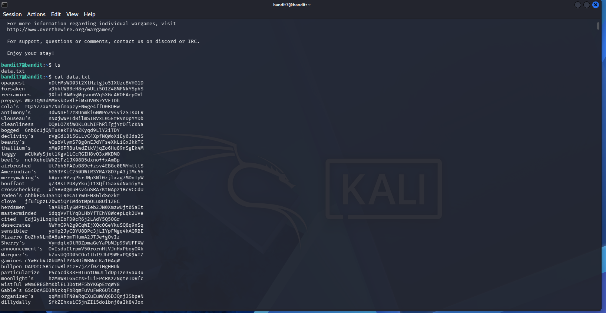

# OverTheWire Bandit — Level 7 → Level 8

## Objective
The password is stored in a file called `data.txt` next to the word **millionth**.

## Connection Details
| Field    | Value                             |
|----------|-----------------------------------|
| Host     | `bandit.labs.overthewire.org`     |
| Port     | `2220`                            |
| Username | `bandit7`                         |
| Password | `morbNTDkSW6jIlUc0ymOdMaLnOlFVAaj` |

## Command Used to Login
```bash
ssh bandit7@bandit.labs.overthewire.org -p 2220
```


---

## The Challenge
`data.txt` contains thousands of lines, each with a word and a password string. The password is on the line next to the word `millionth`. Scrolling manually is not feasible.

```bash
ls
cat data.txt
```



## Solution

Use `grep` to search for the exact word `millionth` and return only that line:

```bash
grep millionth data.txt
```


Output:
```
millionth   dfwvzFQi4mU0wfNbFOe9RoWskMLg7eEc
```

## Password Found
```
dfwvzFQi4mU0wfNbFOe9RoWskMLg7eEc
```

## Logging into Level 8
```bash
ssh bandit8@bandit.labs.overthewire.org -p 2220
```

---

## Why `grep`?

`grep` searches through text line by line and returns lines that match a pattern. It's one of the most essential Linux tools for any analyst.

| Command | Meaning |
|---------|---------|
| `grep millionth data.txt` | Find lines containing "millionth" in data.txt |
| `grep -i millionth data.txt` | Case-insensitive search |
| `grep -n millionth data.txt` | Show line number of match |

---

## Key Takeaways
- `grep` is your go-to tool for searching text inside files
- For large files, never `cat` and scroll — always filter with `grep`
- In SOC work, `grep` is used constantly for log analysis and pattern matching

---

## Commands Reference

| Command | Purpose |
|---------|---------|
| `ls` | Confirm file exists |
| `grep millionth data.txt` | Search for the word and return matching line |

---
