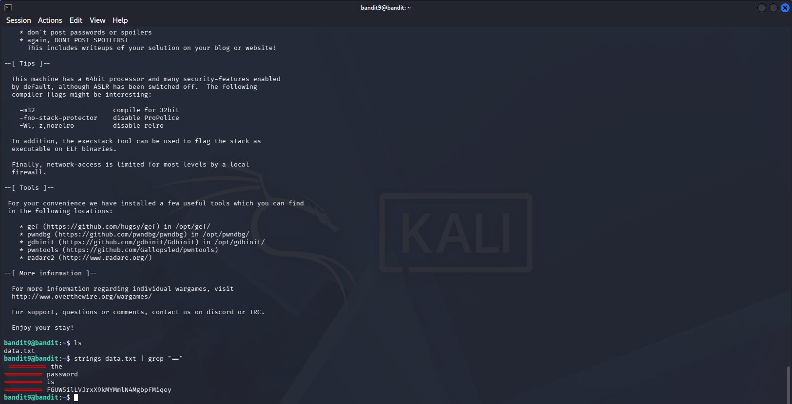

# OverTheWire Bandit — Level 9 → Level 10

## Objective
The password is stored in `data.txt` among a few human-readable strings, preceded by several `=` characters.

## Connection Details
| Field    | Value                             |
|----------|-----------------------------------|
| Host     | `bandit.labs.overthewire.org`     |
| Port     | `2220`                            |
| Username | `bandit9`                         |
| Password | `4CKMh1JI91bUIZZPXDqGanal4xvAg0JM` |

## Command Used to Login
```bash
ssh bandit9@bandit.labs.overthewire.org -p 2220
```


---

## The Challenge
`data.txt` is a binary file — mostly non-readable data. The password is buried inside as a human-readable string preceded by `=` signs. Running `cat` just produces garbage output.

```bash
ls
```

## Solution

Use `strings` to extract all human-readable text from the binary file, then pipe into `grep` to find lines with `=`:

```bash
strings data.txt | grep "="
```



Output:
```
========== the
========== password
========== is
========== FGUW5ilLVJrxX9kMYMmlN4MgbpfMiqey
```

## Password Found
```
FGUW5ilLVJrxX9kMYMmlN4MgbpfMiqey
```

## Logging into Level 10
```bash
ssh bandit10@bandit.labs.overthewire.org -p 2220
```

---

## Breaking Down the Command

```bash
strings data.txt | grep "="
```

| Part | Meaning |
|------|---------|
| `strings data.txt` | Extract all printable character sequences from the binary file |
| `\|` | Pipe output to grep |
| `grep "="` | Filter for lines containing `=` |

---

## Key Takeaways
- `strings` is a key forensics/analysis tool — extracts readable text from binary files
- Binary files cannot be read with `cat` — they produce garbled terminal output
- Combining `strings` + `grep` is a common pattern in malware analysis and CTFs

---

## Commands Reference

| Command | Purpose |
|---------|---------|
| `strings data.txt` | Extract human-readable strings from binary |
| `grep "="` | Filter lines containing `=` signs |
| `strings data.txt \| grep "="` | Combined: find readable lines with `=` |

---

