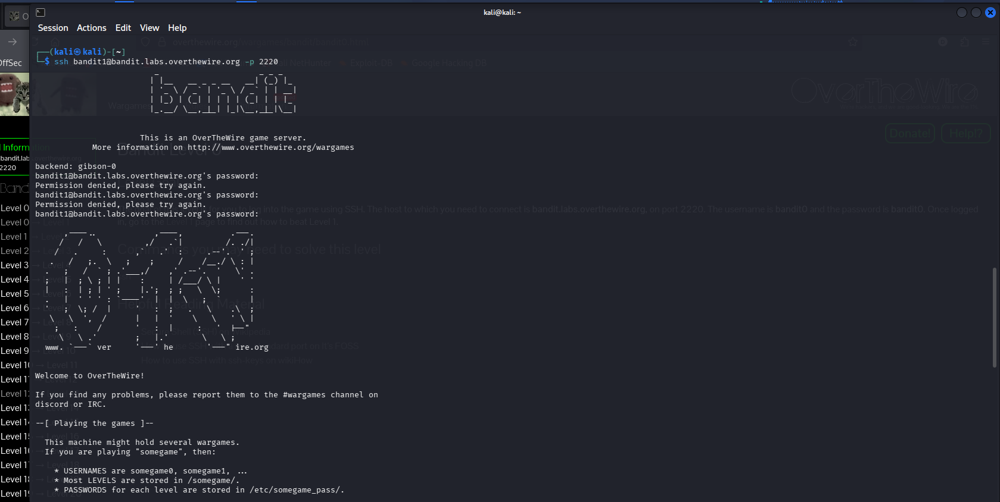
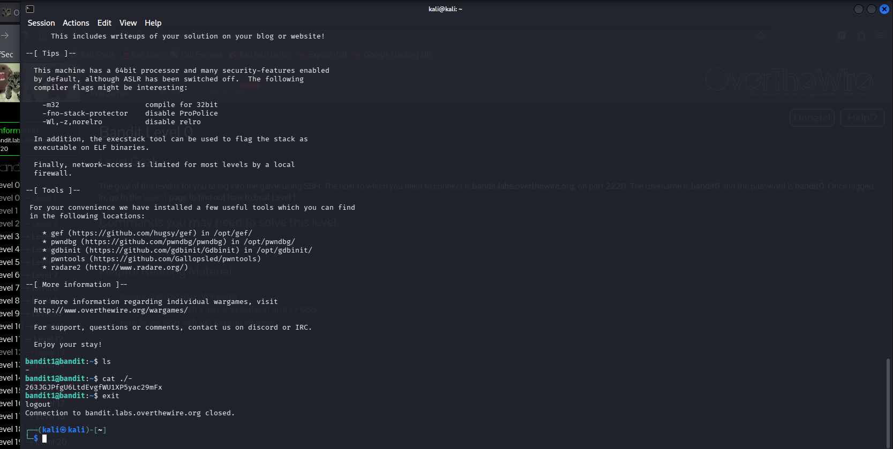

# OverTheWire Bandit — Level 1 → Level 2

## Objective
The password for Level 2 is stored in a file called `-` in the home directory.

## Connection Details
| Field    | Value                               |
|----------|-------------------------------------|
| Host     | `bandit.labs.overthewire.org`       |
| Port     | `2220`                              |
| Username | `bandit1`                           |
| Password | `ZjLjTmM6FvvyRnrb2rfNWOZOTa6ip5If` |

## Command Used to Login
```bash
ssh bandit1@bandit.labs.overthewire.org -p 2220
```



---

## The Challenge
When you run `ls`, the file is named `-`.

```bash
ls
```

Output:
```
-
```

The tricky part — you **cannot** just run `cat -` because in Linux, `-` is interpreted as **stdin** (standard input), not a filename. The terminal will hang waiting for your keyboard input instead of reading the file.

## Solution

Use `./` to explicitly tell the shell it's a file in the current directory, not stdin:

```bash
cat ./-
```



## Output
```
263JGJPfgU6LtdEvgfWU1XP5yac29mFx
```

## Password Found
```
263JGJPfgU6LtdEvgfWU1XP5yac29mFx
```

## Logging into Level 2
```bash
ssh bandit2@bandit.labs.overthewire.org -p 2220
```

---

## Why Does `cat -` Not Work?

In Unix/Linux, `-` is a **special symbol** that most commands interpret as "read from standard input."

| Command    | What happens                              |
|------------|-------------------------------------------|
| `cat -`    | Waits for keyboard input (stdin) — hangs  |
| `cat ./-`  | Reads the actual file named `-`           |
| `cat < -`  | Also works — redirects the file as input  |

Both `cat ./-` and `cat < -` are valid solutions.

---

## Key Takeaways
- Files with special names like `-` require explicit path references
- `./` prefixes the filename with the current directory path, bypassing the special meaning of `-`
- Always think about how the shell **interprets** special characters before running commands

---

## Commands Reference

| Command                      | Purpose                              |
|------------------------------|--------------------------------------|
| `ls`                         | List files — revealed the `-` file   |
| `cat ./-`                    | Read a file literally named `-`      |
| `cat < -`                    | Alternative way to read the file     |

---
