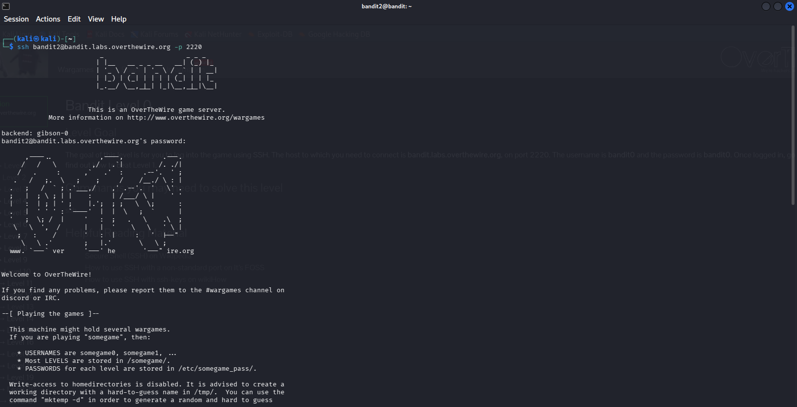
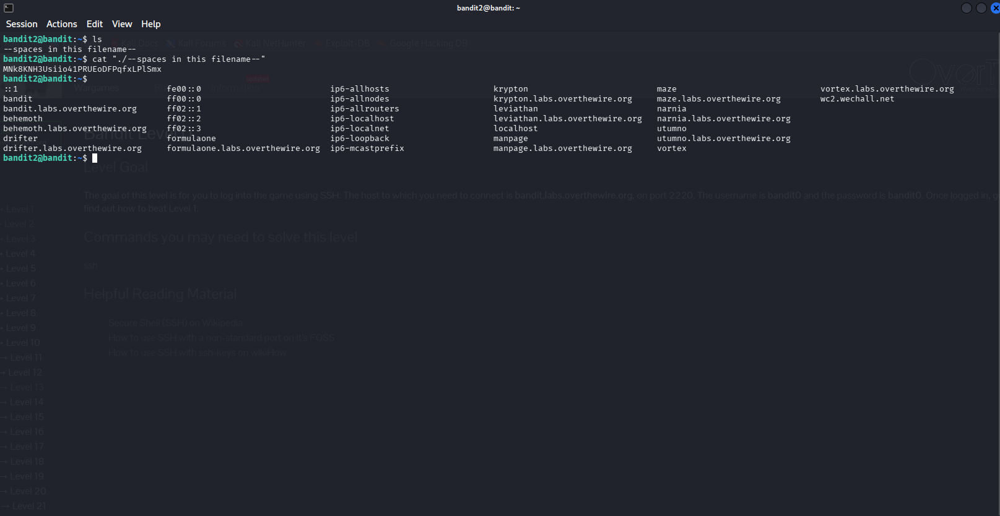

# OverTheWire Bandit — Level 2 → Level 3

## Objective
The password is stored in a file called `--spaces in this filename--` in the home directory.

## Connection Details
| Field    | Value                             |
|----------|-----------------------------------|
| Host     | `bandit.labs.overthewire.org`     |
| Port     | `2220`                            |
| Username | `bandit2`                         |
| Password | `263JGJPfgU6LtdEvgfWU1XP5yac29mFx` |

## Command Used to Login
```bash
ssh bandit2@bandit.labs.overthewire.org -p 2220
```



---

## The Challenge
Running `ls` reveals the file is named `--spaces in this filename--`.

```bash
ls
```

Output:
```
--spaces in this filename--
```

You **cannot** just run `cat --spaces in this filename--` because:
- The shell splits on spaces, treating each word as a separate argument
- `--` is also interpreted as an end-of-options flag by many commands

## Solution

Wrap the filename in quotes so the shell treats it as a single argument:

```bash
cat "./--spaces in this filename--"
```



## Output
```
MNk8KNH3Usiio41PRUEoDFPqfxLPlSmx
```

## Password Found
```
MNk8KNH3Usiio41PRUEoDFPqfxLPlSmx
```

## Logging into Level 3
```bash
ssh bandit3@bandit.labs.overthewire.org -p 2220
```

---

## Why Quotes?

| Command                          | Result                                      |
|----------------------------------|---------------------------------------------|
| `cat --spaces in this filename--` | Error — shell splits on spaces             |
| `cat "--spaces in this filename--"` | Works — treated as one argument          |
| `cat './--spaces in this filename--'` | Also works — single quotes work too    |
| `cat --spaces\ in\ this\ filename--` | Works — backslash escapes each space   |

---

## Key Takeaways
- Filenames with spaces must be quoted or have spaces escaped with `\`
- Using `./` before the filename avoids issues with `--` being misread as a flag
- Tab completion in the terminal auto-escapes spaces — a handy trick

---

## Commands Reference

| Command | Purpose |
|---------|---------|
| `ls` | List files — revealed the spaced filename |
| `cat "./--spaces in this filename--"` | Read file with spaces in name |

---

