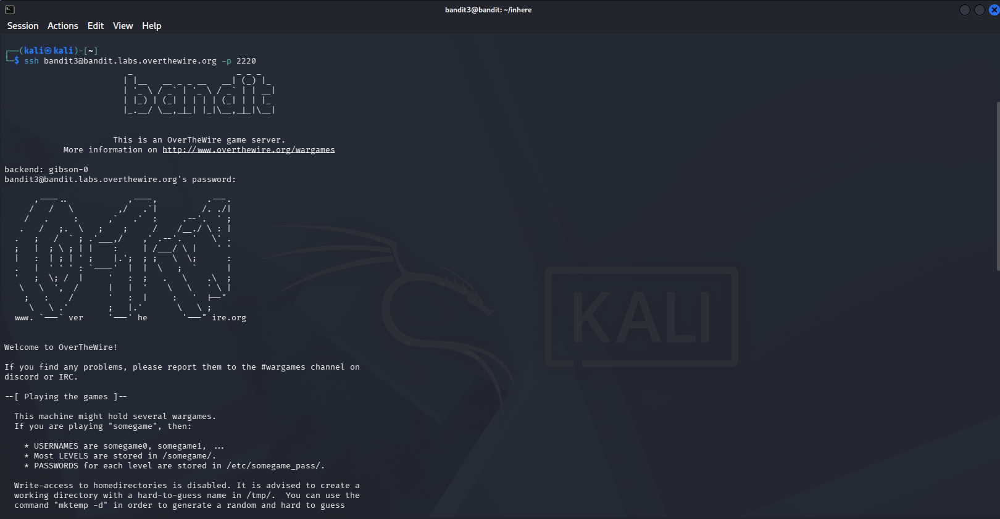
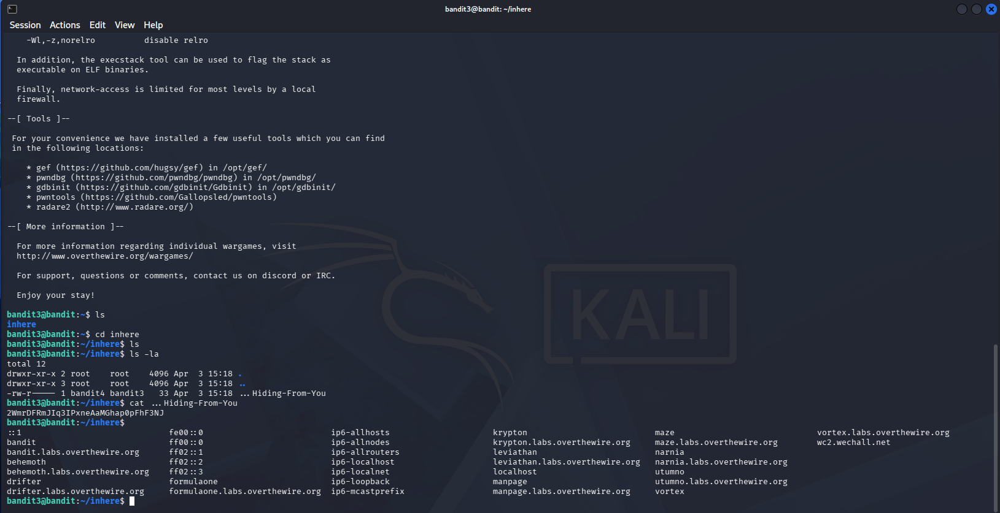

# OverTheWire Bandit — Level 3 → Level 4

## Objective
The password is stored in a hidden file inside the `inhere` directory.

## Connection Details
| Field    | Value                             |
|----------|-----------------------------------|
| Host     | `bandit.labs.overthewire.org`     |
| Port     | `2220`                            |
| Username | `bandit3`                         |
| Password | `MNk8KNH3Usiio41PRUEoDFPqfxLPlSmx` |

## Command Used to Login
```bash
ssh bandit3@bandit.labs.overthewire.org -p 2220
```



---

## The Challenge
Running `ls` shows a directory called `inhere`. Inside it, `ls` returns nothing — because the file is **hidden** (prefixed with `.`).

```bash
ls
cd inhere
ls
```

Nothing shows up with plain `ls`.

## Solution

Use `ls -la` to show **all** files including hidden ones:

```bash
ls -la
cat ...\ Hiding-From-You
```



## Output
```
2WmrDFRmJIq3IPxneAaMGhap0pFhF3NJ
```

## Password Found
```
2WmrDFRmJIq3IPxneAaMGhap0pFhF3NJ
```

## Logging into Level 4
```bash
ssh bandit4@bandit.labs.overthewire.org -p 2220
```

---

## Why `ls -la`?

| Command  | What it shows                                    |
|----------|--------------------------------------------------|
| `ls`     | Only visible files                               |
| `ls -a`  | All files including hidden (dotfiles)            |
| `ls -la` | All files + detailed permissions, owner, size    |

In Linux, any file starting with `.` is hidden from regular `ls`.

---

## Key Takeaways
- Hidden files start with `.` in Linux
- Always use `ls -la` when looking for hidden files
- The file here was named `... Hiding-From-You` — spaces required quoting

---

## Commands Reference

| Command | Purpose |
|---------|---------|
| `cd inhere` | Navigate into the directory |
| `ls -la` | List all files including hidden |
| `cat ...\ Hiding-From-You` | Read the hidden file |

---
