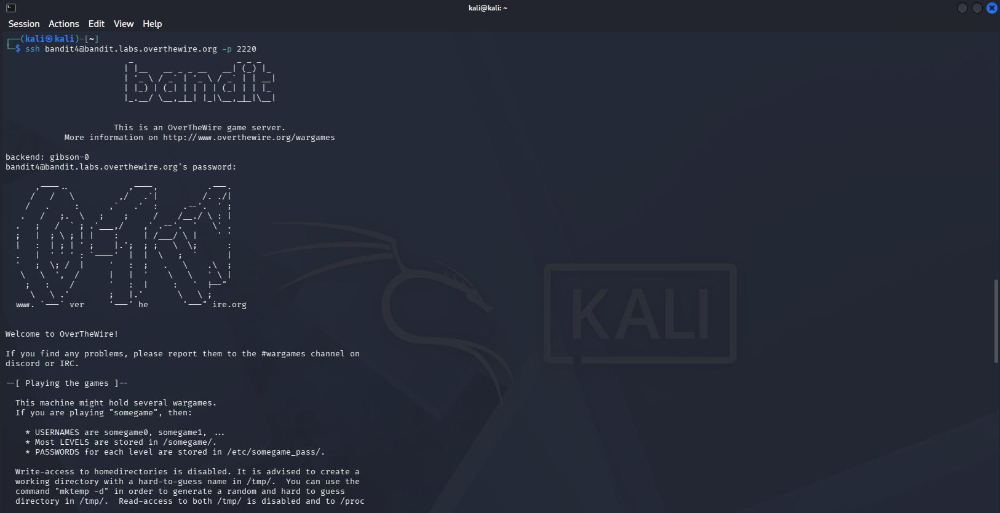
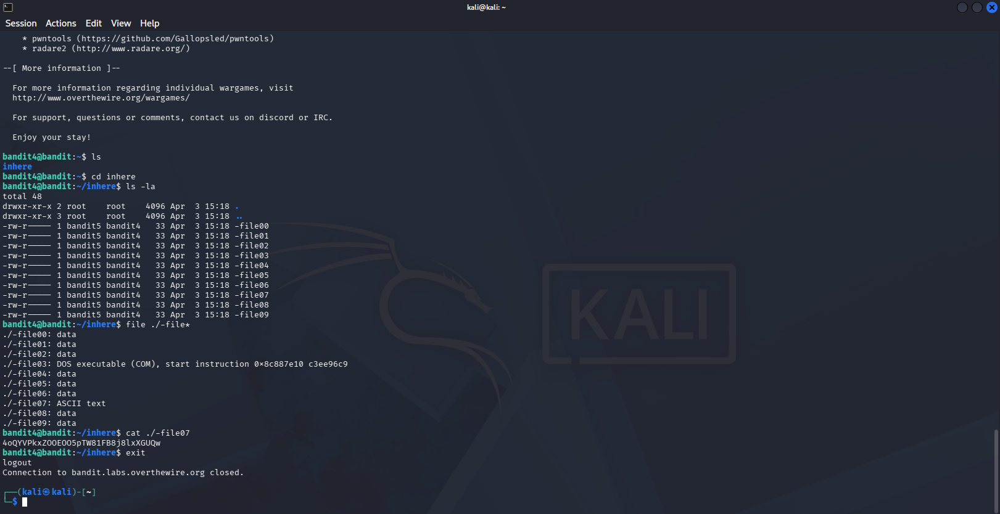

# OverTheWire Bandit — Level 4 → Level 5

## Objective
The password is stored in the only **human-readable** file inside the `inhere` directory, which contains files named `-file00` through `-file09`.

## Connection Details
| Field    | Value                             |
|----------|-----------------------------------|
| Host     | `bandit.labs.overthewire.org`     |
| Port     | `2220`                            |
| Username | `bandit4`                         |
| Password | `2WmrDFRmJIq3IPxneAaMGhap0pFhF3NJ` |

## Command Used to Login
```bash
ssh bandit4@bandit.labs.overthewire.org -p 2220
```



---

## The Challenge
Inside `inhere` there are 10 files: `-file00` to `-file09`. Most contain binary/non-readable data. Only one contains ASCII text (the password).

```bash
ls
cd inhere
ls -la
```

## Solution

Use the `file` command with a wildcard to check the type of every file at once:

```bash
file ./-file*
```



Output:
```
./-file00: data
./-file01: data
./-file02: data
./-file03: DOS executable (COM)
./-file04: data
./-file05: data
./-file06: data
./-file07: ASCII text
./-file08: data
./-file09: data
```

Only `-file07` is **ASCII text** — that's the one!

```bash
cat ./-file07
```

## Password Found
```
4oQYVPkxZOOEO05pTW81FB8j8lxXGUQw
```

## Logging into Level 5
```bash
ssh bandit5@bandit.labs.overthewire.org -p 2220
```

---

## Why `file`?

The `file` command examines the contents of a file and reports its type — regardless of the filename or extension.

| File type    | Meaning                            |
|--------------|------------------------------------|
| `data`       | Binary / non-readable content      |
| `ASCII text` | Plain human-readable text          |
| `DOS executable` | Binary executable              |

---

## Key Takeaways
- `file` is essential for identifying file types without extensions
- Using `./*` or `./-file*` avoids misinterpretation of `-` prefixed names
- When brute-forcing multiple files, always use wildcards instead of checking one by one

---

## Commands Reference

| Command | Purpose |
|---------|---------|
| `cd inhere` | Navigate into the directory |
| `file ./-file*` | Check file type of all files at once |
| `cat ./-file07` | Read the ASCII text file |

---

