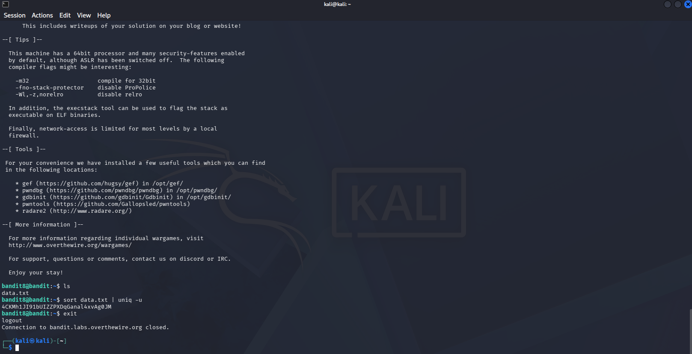

# OverTheWire Bandit — Level 8 → Level 9

## Objective
The password is stored in `data.txt` and is the only line of text that occurs **only once**.

## Connection Details
| Field    | Value                             |
|----------|-----------------------------------|
| Host     | `bandit.labs.overthewire.org`     |
| Port     | `2220`                            |
| Username | `bandit8`                         |
| Password | `dfwvzFQi4mU0wfNbFOe9RoWskMLg7eEc` |

## Command Used to Login
```bash
ssh bandit8@bandit.labs.overthewire.org -p 2220
```


---

## The Challenge
`data.txt` contains many lines, most of which are duplicates. Only one line appears exactly once — that's the password.

```bash
ls
```

## Solution

Use `sort` to group identical lines together, then pipe into `uniq -u` to print only lines that are **not repeated**:

```bash
sort data.txt | uniq -u
```



Output:
```
4CKMh1JI91bUIZZPXDqGanal4xvAg0JM
```

## Password Found
```
4CKMh1JI91bUIZZPXDqGanal4xvAg0JM
```

## Logging into Level 9
```bash
ssh bandit9@bandit.labs.overthewire.org -p 2220
```

---

## Breaking Down the Command

```bash
sort data.txt | uniq -u
```

| Part | Meaning |
|------|---------|
| `sort data.txt` | Sort all lines alphabetically — groups duplicates together |
| `\|` | Pipe: sends output of `sort` as input to `uniq` |
| `uniq -u` | Print only lines that appear **exactly once** |

> **Why sort first?** `uniq` only detects adjacent duplicate lines. Without sorting, duplicates scattered throughout the file would not be detected.

---

## Key Takeaways
- `uniq` requires sorted input to work correctly — always pair it with `sort`
- `uniq -u` = unique only (appears once); `uniq -d` = duplicates only (appears more than once)
- The pipe `|` is a fundamental Linux concept for chaining commands

---

## Commands Reference

| Command | Purpose |
|---------|---------|
| `sort data.txt` | Sort lines alphabetically |
| `uniq -u` | Filter to lines appearing only once |
| `sort data.txt \| uniq -u` | Combined: find the unique line |

---

*Writeup by [yesshhaa](https://github.com/yesshhaa) — OverTheWire Bandit Series*
