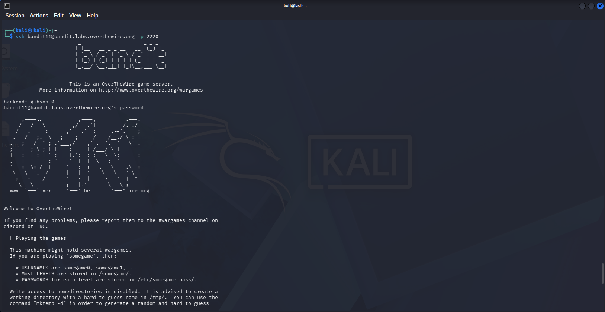
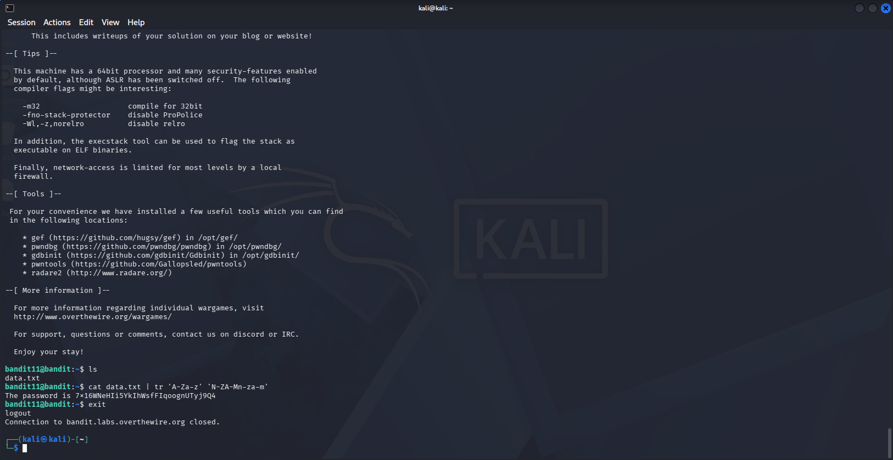

# OverTheWire Bandit — Level 11 → Level 12

## Objective
The password is stored in `data.txt`, where all letters have been **rotated by 13 positions** (ROT13).

## Connection Details
| Field    | Value                             |
|----------|-----------------------------------|
| Host     | `bandit.labs.overthewire.org`     |
| Port     | `2220`                            |
| Username | `bandit11`                        |
| Password | `dtR173fZKb0RRsDFSGsg2RWnpNVj3qRr` |

## Command Used to Login
```bash
ssh bandit11@bandit.labs.overthewire.org -p 2220
```



---

## The Challenge
`data.txt` contains text encoded with ROT13 — a simple letter substitution cipher where each letter is replaced by the letter 13 positions after it in the alphabet. Numbers and symbols are unchanged.

```bash
ls
cat data.txt
```

Encoded content looks like:
```
Gur cnffjbeq vf 7k16WNeHIi5YkIhWsfFIqoognUTyj9Q4
```

## Solution

Use the `tr` command to translate (rotate) letters back by 13 positions:

```bash
cat data.txt | tr 'A-Za-z' 'N-ZA-Mn-za-m'
```



Output:
```
The password is 7x16WNeHIi5YkIhWsfFIqoognUTyj9Q4
```

## Password Found
```
7x16WNeHIi5YkIhWsfFIqoognUTyj9Q4
```

## Logging into Level 12
```bash
ssh bandit12@bandit.labs.overthewire.org -p 2220
```

---

## What is ROT13?

ROT13 is a Caesar cipher variant that shifts every letter by 13 positions. Since the alphabet has 26 letters, applying ROT13 twice returns the original text — encoding and decoding use the exact same operation.

| Input  | A | B | C | ... | M | N | O | ... | Z |
|--------|---|---|---|-----|---|---|---|-----|---|
| Output | N | O | P | ... | Z | A | B | ... | M |

## Breaking Down the `tr` Command

```bash
tr 'A-Za-z' 'N-ZA-Mn-za-m'
```

| Part | Meaning |
|------|---------|
| `tr` | Translate characters |
| `'A-Za-z'` | Input set: all uppercase and lowercase letters |
| `'N-ZA-Mn-za-m'` | Output set: letters shifted by 13 positions |

---

## Key Takeaways
- ROT13 is a classic CTF encoding — always worth recognizing
- `tr` is a powerful character translation tool in Linux
- ROT13 is its own inverse — the same command encodes and decodes
- Real-world use: obfuscating spoilers, basic text scrambling

---

## Commands Reference

| Command | Purpose |
|---------|---------|
| `cat data.txt` | View ROT13 encoded content |
| `cat data.txt \| tr 'A-Za-z' 'N-ZA-Mn-za-m'` | Decode ROT13 |

---

